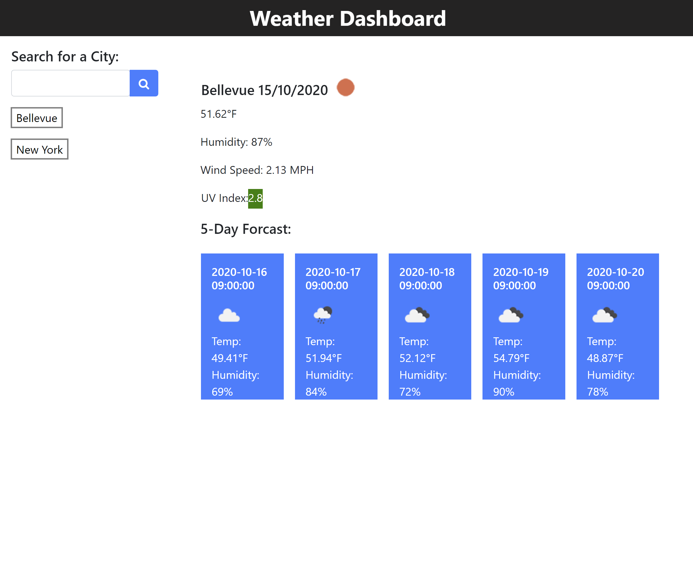
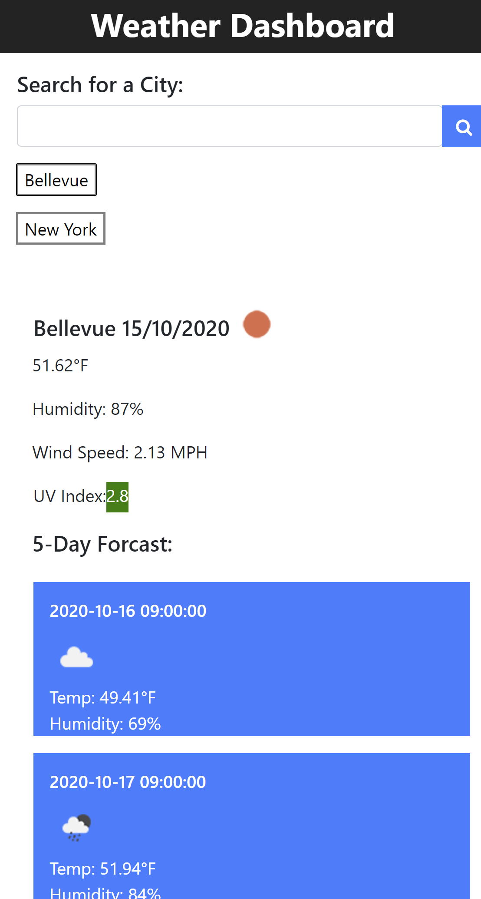

# Weather-Dashboard

Project link: [https://github.com/lillianhuynh/Weather-Dashboard]

Github-page: [https://lillianhuynh.github.io/Weather-Dashboard/]

## Table of Contents

* [About the Project](#about-the-project)
  * [Built With](#built-with)
* [Getting Started](#getting-started)
  * [Installation](#installation)
* [Usage](#usage)
* [Roadmap](#roadmap)
* [Contributing](#contributing)
* [License](#license)
* [Contact](#contact)

## About The Project


'Weather Dashboard' application was designed to provide an easy way to access accurate weather forecast information for users. 

Users can find current weather forecast, 5 days forecast and the UV Index of cities all around the world.

The auto save feature of this app helps Users to retrieve the weather forcast of the cities that they searched for.

### Built With

jQuery
Bootstrap
OpenWeather

## Getting Started

To get a local copy up and running follow these simple steps.

### Installation

1. Clone the repo
```sh
git clone https://github.com/lillianhuynh/Weather-Dashboard
```

## Usage

| Desktop screen     | Mobile screen |
|------------|------------|
|  |  |

You can start by entering a city name. Onces you click the search button, current forecast, 5 days forecast and UVindex will be generated and displayed. The searched cities will also be automatically saved.

Current weather condition display city name, the date, an icon representation of weather conditions, the temperature, the humidity, the wind speed, and the UV index.

UV index colors indicates:
Green for "Low"
Yellow for	"Moderate"
Orange for "High"
Red for "Very high"
Violet for "Extreme"

5-day forecast displays the date, an icon representation of weather conditions, the temperature, and the humidity.

## Roadmap

See the [open issues](https://github.com/lillianhuynh/Weather-Dashboard/issues) for a list of proposed features (and known issues).

## Contributing

Contributions are what make the open source community such an amazing place to be learn, inspire, and create. Any contributions you make are **greatly appreciated**.

1. Fork the Project
2. Create your Feature Branch (`git checkout -b feature/AmazingFeature`)
3. Commit your Changes (`git commit -m 'Add some AmazingFeature'`)
4. Push to the Branch (`git push origin feature/AmazingFeature`)
5. Open a Pull Request

## License

N/A

## Contact

Lili Huynh- lillianhuynh312@gmail.com
Project link: [https://github.com/lillianhuynh/Weather-Dashboard]
